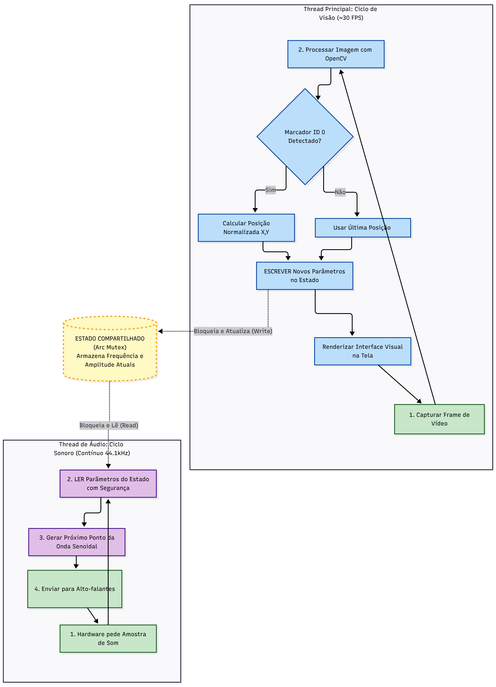

# ArUco Theremin

Este projeto foi desenvolvido para a disciplina de Linguagens de Programação da Universidade de Brasília (UnB) no semestre 2025.2.

**Grupo:**
* Daniel Luz - Arquitetura e Manipulação de Vídeo com OpenCV
* Davi Vidal - Síntese de Áudio com Rodio
* Tiago Amaral - Avaliação da Linguagem de Programação

**Professor:** Marcelo Ladeira

## Sobre o Projeto

Um instrumento virtual controlado por câmera escrito em Rust. O projeto rastreia um marcador ArUco (ID 0) e transforma a posição dele em som.

## Diagramas

### Fluxo Completo

<picture>
  
</picture>

### Fluxo Simplificado

<picture>
  
</picture>

## Compatibilidade

| Sistema | Status | Observação |
|---|---|---|
| Windows | Funcional | Roda nativamente. |
| WSL | Nao funciona | Problemas com driver de vídeo/áudio. |
| Linux/Mac | Nao testado | Sem informação. |

## Pré-requisitos para Compilar

Para que o projeto compile e rode, você precisa ter instalado no seu sistema:

1.  **Rust** (via Cargo).
2.  **OpenCV 4.11**: É **obrigatório** ter a versão 4.11 instalada e configurada nas variáveis de ambiente (ou via `vcpkg` no Windows). Sem isso, o crate `opencv` não irá compilar.

## Como Usar

Você precisa deste marcador ArUco (ID 0, Dicionário Original) impresso ou na tela do celular para que a câmera o detecte.

<picture>
  
</picture>

No terminal, execute:

```bash
cargo run --release